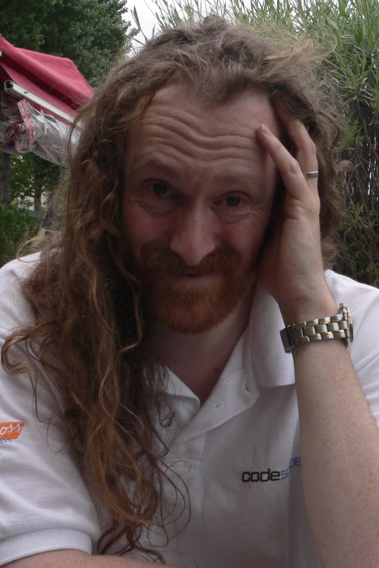

--- 
title: |
  Grahams (M7GRW) QSL pages
  {width=1in}
author: "Graham Whaley"
date: "`r Sys.Date()`"
site: bookdown::bookdown_site
output: bookdown::gitbook
documentclass: book
bibliography: [book.bib]
biblio-style: apalike
link-citations: yes
github-repo: grahamwhaley/qsl.net
description: "Grahams QSL.net static web pages, generated with 'bookdown'."
---

# Overview {-}

Hi. I'm a U.K. based radio amateur, licensed in July 2020.

I live in a fairly suburban area in the North of England. I have a reasonably sized garden area, but
the combination of suburbia, power and telephone cables etc. leave me with a moderately (but not
overly) challenging QTH. No, I don't think I can manage to get an 80m half wave antenna up, not
without some 'cheating'.

The QTH is reasonably elevated - about 100m above sea level, but is on the South side of a hill
that peaks at about 140m. Views South are great. East and West are OK. The North view is somewhat
more challenging.

VHF/UHF here is a bit dead. There are some local repeaters, but due to the topography I have
so far only heard one to the South.

Thus, I'll mostly be looking at HF work. Right now SSB rag chewing is not really 'calling' me, and
data modes just don't feel very 'traditional'. I like the challenge of being able to 'reach' far
far away - so will start by working towards CW and hopefully DX CW.

In my previous life (pre-retirement) I studied for a degree in Communications Engineering (basically,
radio and electronics), and then Computer Science. I spent >30 years as an embedded software engineer,
and have a reasonably au-fait relationship with the hardware, particularly the digital side of things.

On this site you'll find a few pages relating to some of my equipment and experiments.

---

These pages were generated using [bookdown](https://bookdown.org/). The sources live in a
[repo on github](https://github.com/grahamwhaley/qsl.net).
